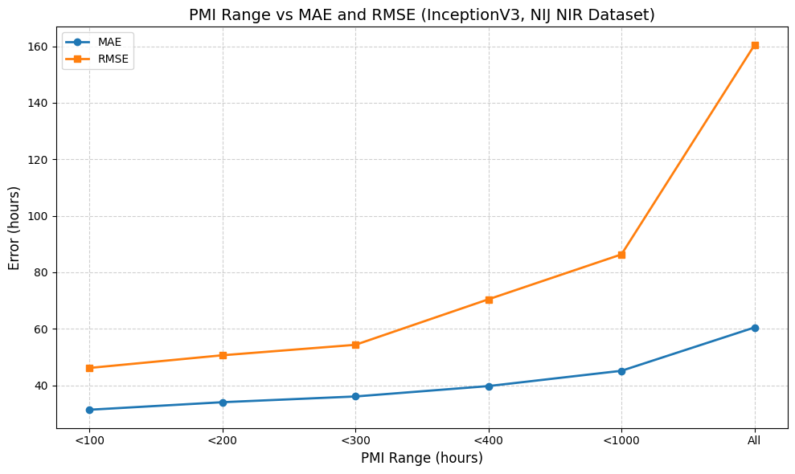
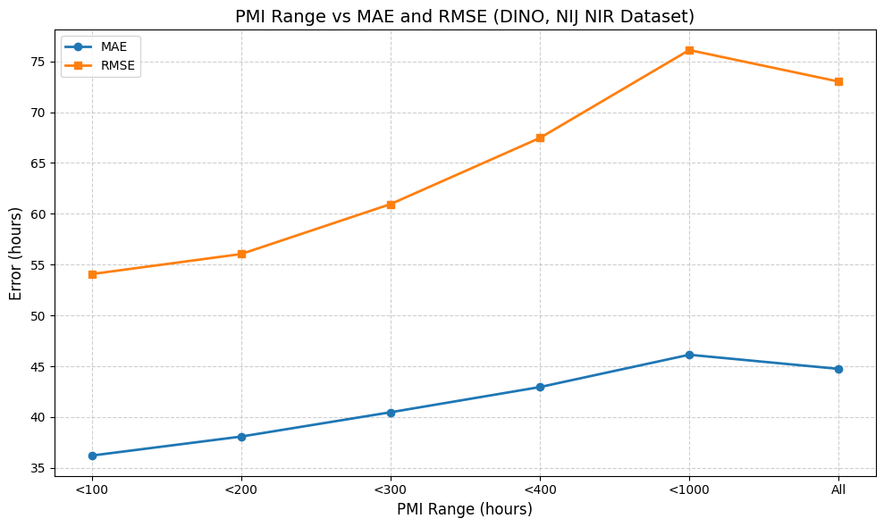

# 🧠 Post-Mortem Interval Estimation using Forensic Iris Images

This project explores **deep learning-based Post-Mortem Interval (PMI) estimation** using **RGB and NIR iris images** of deceased individuals. Built as part of my **Bachelor’s Thesis at IISER Bhopal**, this work benchmarks both classical CNNs and modern vision transformer architectures across realistic forensic scenarios.


## 🔍 Problem Statement

**PMI** refers to the time elapsed since death. Accurate estimation is crucial for:

- Time of death (TOD) analysis in forensics  
- Biometric identification of missing persons  
- Automation of forensic workflows using iris data

While physical and biochemical cues are traditionally used for PMI, biometric iris images remain underutilized. This work aims to fill that gap using **deep learning models trained on post-mortem iris images**.

## 🧪 Research Contributions

- 📊 **First-of-its-kind benchmarking** of Vision Transformers (DINO, CLIP) and CNNs (InceptionV3, DenseNet121) on PMI regression  
- 🔍 Explored **RGB**, **NIR**, and **multispectral (RGB+NIR)** inputs  
- ⚙️ Built pipelines for **subject-disjoint**, **sample-disjoint**, and **cross-dataset** evaluations  
- 🧠 Proposed MLP-based regression using transformer embeddings for improved generalization

## 🗃️ Dataset Overview

Three datasets have been utilised in this study. Warsaw Biobase v3 and NIJ dataset are open-source datasets readily available and Synthetic Dataset was created using Style-GANs to handle the data scarcity issue and improve model robustness. Details regarding the datasets are provided in the below table - 

| Dataset         | Type      | Subjects | Images | Spectrum  | PMI Range (hours) |
|----------------|-----------|----------|--------|-----------|-------------------|
| Warsaw Biobase | Real      | 79       | 4,866  | RGB + NIR | 5 – 814           |
| NIJ Dataset | Real | 269 | 10,413 | RGB + NIR  | 0 – 1674          |
| Synthetic Dataset  | Simulated | 1000/class × 18 | 180,000 | NIR only  | 0 – 1674          |


🔍 **Challenge**: Dataset is highly imbalanced — majority samples lie in lower PMI ranges. Iris degradation at high PMIs causes severe loss of texture, impacting prediction.

## 🧠 Methodology

### 📸 CNN-Based Models
- Backbones: `InceptionV3`, `DenseNet121`
- Separate models for RGB, NIR, and multispectral images
- Used fully connected regression head to predict continuous PMI

### 🧠 Vision Transformer Models
- Feature extractors: `CLIP ViT-B/16`, `DINOv2`
- Frozen vision encoder → feature vector → MLP regressor
- Trained on RGB, NIR, and combined embeddings

## 🧪 Evaluation Strategies

| Split Type        | Description                                                  |
|-------------------|--------------------------------------------------------------|
| Sample-wise       | Same subjects, different samples in train/test               |
| Subject-wise      | Different subjects from same dataset                         |
| Cross-dataset     | Training and testing on different datasets (most realistic)  |

## 📊 Results Summary
<!-- Comparative results: InceptionV3 vs DINO (NIJ NIR) -->
<table>
  <thead>
    <tr>
      <th rowspan="2">PMI&nbsp;Range</th>
      <th colspan="2">Inception&nbsp;V3</th>
      <th colspan="2">DINO</th>
    </tr>
    <tr>
      <th>MAE</th>
      <th>RMSE</th>
      <th>MAE</th>
      <th>RMSE</th>
    </tr>
  </thead>
  <tbody>
    <tr>
      <td>&lt; 100 h&nbsp;(4 d)</td>
      <td>31.36</td>
      <td>46.15</td>
      <td>36.21</td>
      <td>54.07</td>
    </tr>
    <tr>
      <td>&lt; 200 h&nbsp;(8 d)</td>
      <td>34.03</td>
      <td>50.64</td>
      <td>38.08</td>
      <td>56.04</td>
    </tr>
    <tr>
      <td>&lt; 300 h&nbsp;(12.5 d)</td>
      <td>36.06</td>
      <td>54.34</td>
      <td>40.47</td>
      <td>60.95</td>
    </tr>
    <tr>
      <td>&lt; 400 h&nbsp;(16 d)</td>
      <td>39.74</td>
      <td>70.45</td>
      <td>42.95</td>
      <td>67.46</td>
    </tr>
    <tr>
      <td>&lt; 1000 h&nbsp;(41 d)</td>
      <td>45.15</td>
      <td>86.34</td>
      <td>46.13</td>
      <td>76.11</td>
    </tr>
    <tr>
      <td><strong>All&nbsp;PMIs</strong></td>
      <td><strong>60.48</strong></td>
      <td><strong>160.44</strong></td>
      <td><strong>44.74</strong></td>
      <td><strong>73.01</strong></td>
    </tr>
  </tbody>
</table>

<div>
  

  

</div>


> 📌 **DINO** showed better generalization on high PMI ranges. **InceptionV3** had better performance in early PMI ranges. Multispectral models worked best in subject-disjoint settings.

## ⚠️ Challenges

- 📉 High RMSE for high-PMI images due to iris degradation  
- 📊 Dataset imbalance: majority samples in early PMI classes  
- 🌫️ Environmental degradation blurs and occludes iris structures

## 🔧 Getting Started

```bash
git clone https://github.com/AkshatP0285/PMI-Estimation-Using-Forensic-Iris-Images
cd PMI-Estimation-Using-Forensic-Iris-Images
pip install -r requirements.txt
